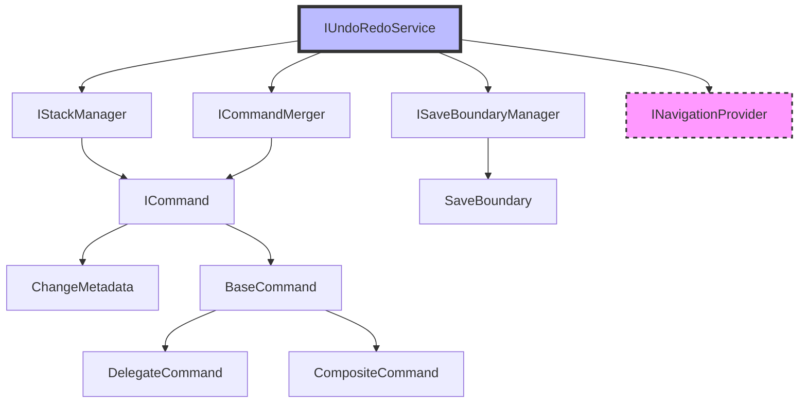

# Contracts (Interfaces)

This document describes all the interfaces (contracts) in the UndoRedo library, their responsibilities, and how they work together.

## Overview

The library is built around well-defined contracts that enable:

-   **Loose Coupling**: Components depend on abstractions, not implementations
-   **Testability**: Easy to create mock implementations for testing
-   **Extensibility**: Add new implementations without changing existing code
-   **Flexibility**: Swap implementations based on requirements

## Core Service Interfaces

### IUndoRedoService

The main service interface that orchestrates all undo/redo operations.

```csharp
public interface IUndoRedoService
{
    // State Properties
    bool CanUndo { get; }
    bool CanRedo { get; }
    int CurrentPosition { get; }
    int CommandCount { get; }
    bool HasUnsavedChanges { get; }
    IReadOnlyList<SaveBoundary> SaveBoundaries { get; }
    IReadOnlyList<ICommand> Commands { get; }

    // Events
    event EventHandler<CommandExecutedEventArgs>? CommandExecuted;
    event EventHandler<CommandUndoneEventArgs>? CommandUndone;
    event EventHandler<CommandRedoneEventArgs>? CommandRedone;
    event EventHandler<SaveBoundaryCreatedEventArgs>? SaveBoundaryCreated;

    // Core Operations
    void Execute(ICommand command);
    Task<bool> UndoAsync(bool navigateToChange = true, CancellationToken cancellationToken = default);
    bool Undo();
    Task<bool> RedoAsync(bool navigateToChange = true, CancellationToken cancellationToken = default);
    bool Redo();

    // Save Boundaries
    void MarkAsSaved(string? description = null);
    IEnumerable<ICommand> GetCommandsToUndo(SaveBoundary saveBoundary);
    Task<bool> UndoToSaveBoundaryAsync(SaveBoundary saveBoundary, bool navigateToLastChange = true, CancellationToken cancellationToken = default);

    // Utilities
    void Clear();
    IEnumerable<ChangeVisualization> GetChangeVisualizations(int maxItems = 50);
}
```

**Responsibilities:**

-   Coordinate all undo/redo operations
-   Manage the overall workflow and state
-   Provide the public API for clients
-   Handle events and notifications
-   Manage async operations and navigation

**Key Design Points:**

-   **Async Support**: Both sync and async versions of operations
-   **Event-Driven**: Raises events for all major operations
-   **Navigation Integration**: Optional navigation to changes
-   **Save Boundary Support**: Track save states
-   **Visualization**: Support for UI representation

### IStackManager

Manages the command stack storage and position tracking.

```csharp
public interface IStackManager
{
    // State
    IReadOnlyList<ICommand> Commands { get; }
    int CurrentPosition { get; }
    bool CanUndo { get; }
    bool CanRedo { get; }

    // Stack Operations
    void AddCommand(ICommand command);
    ICommand? MovePrevious();
    ICommand? MoveNext();
    void ClearForward();
    void Clear();
    int TrimToSize(int maxSize);

    // Query Operations
    ICommand? GetCurrentCommand();
    IEnumerable<ICommand> GetCommandsInRange(int startIndex, int count);
}
```

**Responsibilities:**

-   Store commands in a stack structure
-   Track current position in the stack
-   Provide navigation through the stack (undo/redo)
-   Manage stack size and cleanup
-   Provide read-only access to commands

**Key Design Points:**

-   **Pure Data Structure**: No business logic, just storage
-   **Position Tracking**: Maintains current execution position
-   **Branching Support**: Clears forward when new commands added
-   **Memory Management**: Configurable stack size limits

### ISaveBoundaryManager

Manages save boundaries and tracks unsaved changes.

```csharp
public interface ISaveBoundaryManager
{
    // State
    IReadOnlyList<SaveBoundary> SaveBoundaries { get; }

    // Core Operations
    bool HasUnsavedChanges(int currentPosition);
    SaveBoundary CreateSaveBoundary(int position, string? description = null);
    int CleanupInvalidBoundaries(int maxValidPosition);
    void AdjustPositions(int adjustment);

    // Query Operations
    SaveBoundary? GetLastSaveBoundary();
    IEnumerable<ICommand> GetCommandsToUndo(SaveBoundary saveBoundary, int currentPosition, IReadOnlyList<ICommand> commands);
    void Clear();
}
```

**Responsibilities:**

-   Track save points in the command history
-   Determine if there are unsaved changes
-   Manage boundary lifetime and validity
-   Adjust boundaries when stack changes
-   Provide navigation to save points

**Key Design Points:**

-   **Position Tracking**: Boundaries are linked to stack positions
-   **Automatic Cleanup**: Invalid boundaries are cleaned up
-   **Change Detection**: Efficiently detects unsaved changes
-   **Position Adjustment**: Handles stack modifications

### ICommandMerger

Handles merging of compatible commands for optimization.

```csharp
public interface ICommandMerger
{
    bool CanMerge(ICommand first, ICommand second);
    ICommand Merge(ICommand first, ICommand second);
}
```

**Responsibilities:**

-   Determine if two commands can be merged
-   Perform the actual merging operation
-   Optimize command stack size through merging

**Key Design Points:**

-   **Simple Interface**: Only two methods for clear contract
-   **Stateless**: No internal state, pure functions
-   **Delegation**: Actual merging logic delegated to commands
-   **Error Handling**: Clear contract about when merging fails

## Command Interface

### ICommand

The core interface for all commands in the system.

```csharp
public interface ICommand
{
    // Properties
    string Description { get; }
    string? NavigationContext { get; }
    ChangeMetadata Metadata { get; }

    // Core Operations
    void Execute();
    void Undo();

    // Merging Support
    bool CanMergeWith(ICommand other);
    ICommand MergeWith(ICommand other);
}
```

**Responsibilities:**

-   Encapsulate a reversible operation
-   Provide metadata about the change
-   Support command merging when applicable
-   Enable navigation to the change location

**Key Design Points:**

-   **Command Pattern**: Classic implementation with Execute/Undo
-   **Metadata Rich**: Detailed information about the change
-   **Merging Capable**: Optional merging for optimization
-   **Navigation Aware**: Optional context for UI navigation

## Optional Interfaces

### INavigationProvider

Optional interface for navigation integration (not part of core library).

```csharp
public interface INavigationProvider
{
    Task NavigateToAsync(string context, CancellationToken cancellationToken);
}
```

**Responsibilities:**

-   Navigate to the location of a change
-   Handle application-specific navigation logic
-   Support cancellation for long-running operations

**Key Design Points:**

-   **Optional**: Not required for basic undo/redo functionality
-   **Async**: Supports complex navigation scenarios
-   **Cancellable**: Respects cancellation tokens
-   **Context-Driven**: Uses string context from commands

## Interface Relationships



## Contract Guidelines

### Interface Design Principles

1. **Single Responsibility**: Each interface has one clear purpose
2. **Minimal Surface**: Only essential methods in each interface
3. **Stable Contracts**: Interfaces change rarely, if ever
4. **Clear Semantics**: Method names and signatures are self-documenting
5. **Async-Ready**: Support for asynchronous operations where needed

### Implementation Guidelines

1. **Null Checks**: Always validate parameters in implementations
2. **Exception Safety**: Use appropriate exceptions for contract violations
3. **Thread Safety**: Document thread safety guarantees
4. **Performance**: Consider performance implications of interface design
5. **Testability**: Interfaces should be easy to mock and test

### Extension Guidelines

1. **New Interfaces**: Create focused, minimal interfaces for new functionality
2. **Versioning**: Use new interfaces rather than modifying existing ones
3. **Backward Compatibility**: Maintain compatibility within major versions
4. **Documentation**: Clearly document interface contracts and expectations

## Common Patterns

### Dependency Injection Registration

```csharp
// Register all core services
services.AddTransient<IStackManager, StackManager>();
services.AddTransient<ISaveBoundaryManager, SaveBoundaryManager>();
services.AddTransient<ICommandMerger, CommandMerger>();
services.AddTransient<IUndoRedoService, UndoRedoService>();

// Optional navigation provider
services.AddTransient<INavigationProvider, MyNavigationProvider>();
```

### Mock Creation for Testing

```csharp
// Easy to mock due to focused interfaces
var mockStackManager = new Mock<IStackManager>();
var mockSaveBoundaryManager = new Mock<ISaveBoundaryManager>();
var mockCommandMerger = new Mock<ICommandMerger>();

mockStackManager.Setup(x => x.CanUndo).Returns(true);
mockStackManager.Setup(x => x.MovePrevious()).Returns(someCommand);

var service = new UndoRedoService(
    mockStackManager.Object,
    mockSaveBoundaryManager.Object,
    mockCommandMerger.Object);
```

### Custom Implementation Example

```csharp
// Custom stack manager with different storage strategy
public class DatabaseStackManager : IStackManager
{
    private readonly IDbContext _context;

    public DatabaseStackManager(IDbContext context)
    {
        _context = context;
    }

    public void AddCommand(ICommand command)
    {
        // Store command in database
        _context.Commands.Add(new CommandEntity(command));
        _context.SaveChanges();
    }

    // ... implement other interface methods
}
```

## Benefits of Contract-Based Design

1. **Testability**: Easy to create mocks and test doubles
2. **Flexibility**: Swap implementations without changing client code
3. **Extensibility**: Add new functionality through new interfaces
4. **Maintainability**: Clear separation of concerns
5. **Documentation**: Interfaces serve as API documentation
6. **IntelliSense**: Strong typing enables better IDE support
7. **Refactoring**: Safe refactoring through compiler checks
